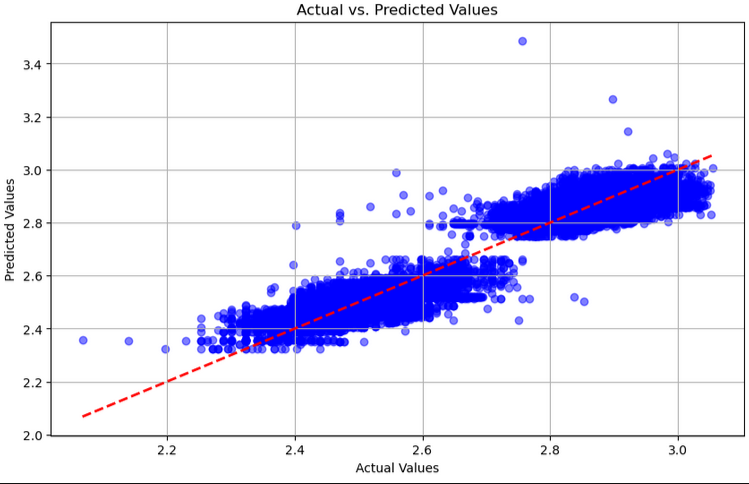

## Instructions 

#### Run one by one cell to get the desired output 
#### see pdf file for accuracy details

## Y-predicted vs Y-test values

### Result without log scaling(price column) and applying mean(categorical columns).

r squared 0.2508702283108002
mean absolute error 13593760.503168177
mean squared error 783789731515877.6
root mean squared error 27996244.95384832
cross validation score [0.23326074 0.23816514 0.27230528 0.19416271 0.28653404]

### Result without log scaling(price column) and applying median(categorical columns).

r squared 0.2541608405447441
mean absolute error 13628517.703470087
mean squared error 780346872645711.4
root mean squared error 27934689.413804322
cross validation score [0.23701574 0.24266528 0.27647448 0.19847968 0.28123076]

### Result with log scaling(price column) and applying median(categorical columns) and without removing irrelevant prices.

r squared 0.5884200268719106
mean absolute error 0.43010714320604854
mean squared error 0.3039382342801839
root mean squared error 0.5513059352847418
cross validation score [0.64526904 0.63194138 0.60907606 0.52892513 0.41032043]

### Result with log scaling two times(price column) and applying median(categorical columns) and without removing irrelevant prices.

r squared 0.5291768459830932
mean absolute error 0.03670397374698471
mean squared error 0.0021857372125364117
root mean squared error 0.04675186854593527
cross validation score [0.57483158 0.57095123 0.5488171  0.48679184 0.37015736]

### Result with log scaling two times(price column) and applying median(categorical columns) and removing irrelevant prices.

r squared 0.9325492093718043
mean absolute error 0.03663920337696029
mean squared error 0.0022403707234302543
root mean squared error 0.04733255458381952
cross validation score [0.92797531 0.92598692 0.93349989 0.92063888 0.94078825]

### All above options + included another column(location).

r squared 0.9331417643755717
mean absolute error 0.03651558861165513
mean squared error 0.0022206890729988982
root mean squared error 0.04712418777017699
cross validation score [0.9280527  0.92644621 0.93416748 0.92164674 0.94138462]
